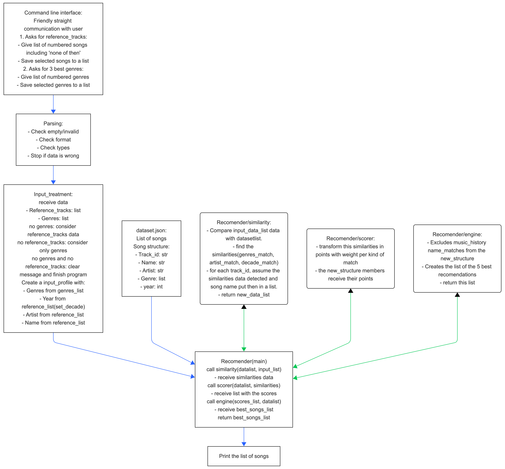

*This is a personal project to develop python skills by Carlos Alvares.
# music_recomendation_tool

## Description
In this project I create a music recomender tool, which considers initial music references and user prefered genres to return to the user a list of recommended tracks.

### Goal
To output the best list of recommended songs according to the user profile which consists in choosen genres and favorite songs.

### The challenge
- Get the genre and the favorite songs using a CLI.
- Set this data to be used by the engine.
- Build an engine that order the data_set by points.
- Create a list with the top tracks.
- Output this list.

### The algorithm

### Full program flow:
```
CLI
↓
selected_tracks + genre
↓
input_profile()
↓
profile
↓
engine(dataset, profile)
↓
scores
↓
top N recomendações
```
### Flow explained:


